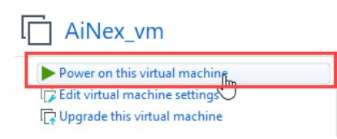

> **Lesson** **4** **Gazebo** **Simulation** **&** **Motion**
> **Planning**
>
> **Note:**
>
> **1.** **Before** **starting** **the** **simulation,** **ensure**
> **that** **your** **computer** **has** **VMware** **virtual**
> **machine** **installed.** **If** **you** **haven't** **completed**
> **the** **installation,** **please** **refer** **to** **the**
> **tutorial** **"Lesson** **2** **URDF** **Model** **Explanation"**
> **for** **environment** **setup.**
>
> **2.** **All** **the** **following** **operations** **require**
> **coordination** **with** **the** **VM** **virtual** **machine,**
> **so** **please** **make** **sure** **to** **open** **the**
> **virtual** **machine** **in** **advance.**
>
> **1.** **Open** **Terminal** **within** **Virtual** **Machine**
>
> 1\) Open VMware, and click-on “**Power** **on** **this** **virtual**
> **machine**”.
>
> 2)
> Click-on to open the terminal.
>
> 3

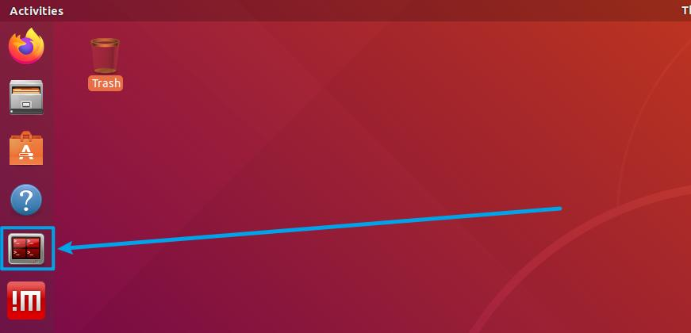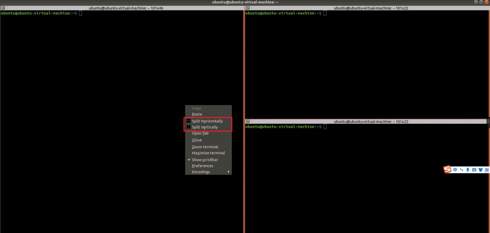

> 3\) Maximize the terminal window, then right-click on it and choose
> 'Split
>
> Vertically' to create a new terminal. After that, right-click the new
> terminal and
>
> select 'Split Horizontal' to add one more terminal.
>
> **2.** **Execute** **Running** **Command**
>
> **Note:** **the** **following** **commands** **need** **to** **be**
> **executed** **in** **sequence.**
>
> 1\) Three terminals are available.
>
> 3

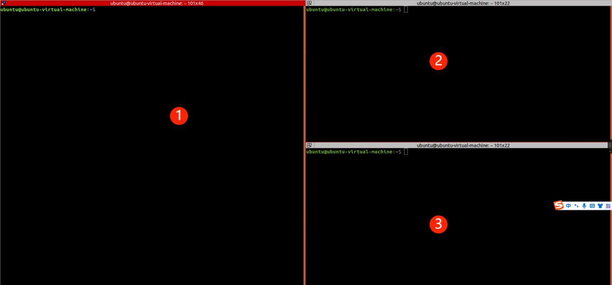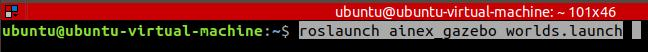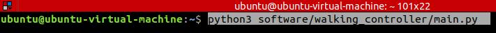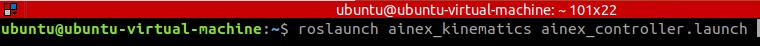

> 2\) Execute the command “**roslaunch** **ainex_gazebo**
> **worlds.launch**”on terminal
>
> ①to enable the gazebo model.
>
> 3\) Run the following command “**python3**
>
> **software/walking_controller/main.py**”on terminal ②to enable the PC
>
> software program. Please note that the PC software will initiated
> after ROS
>
> service is enabled.
>
> 4\) Execute this command “**roslaunch** **ainex_kinematics**
>
> **ainex_controller.launch**” on terminal ③to initiate ROS service.
> After this
>
> service is enabled successfully, PC software can be opened.
>
> 5\) After the above programs and services have completed running, you
> will see
>
> two applications named '**Gazebo**' and '**walking** **controller**.
>
> 3

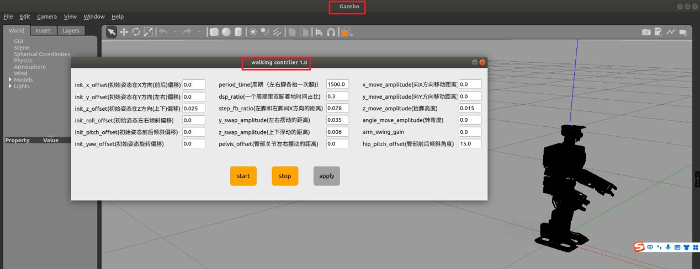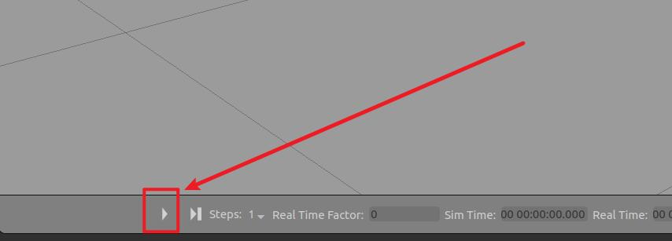

> **3.** **Start** **Simulation**
>
>  style="width:0.15667in;height:0.20833in" />1) Click-on on Gazebo
> window to start simulation, then the robot will
>
> transform into bending posture from standing posture.
>
> **Note:**
>
> 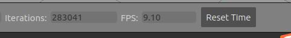 style="width:5.76333in;height:0.74792in" />**After** **starting**
> **the** **simulation,** **keep** **an** **eye** **on** **the**
> **frame** **rate** **(FPS)** **displayed** **beneath** **the**
> **Gazebo** **simulation** **window.** **If** **it** **drops**
> **below** **'9'** **FPS,** **you** **should** **consider** **using**
> **a** **more** **powerful** **computer.** **Otherwise,**
> **insufficient** **computer** **performance** **could** **result**
> **in** **abnormal** **movements** **or** **even** **falls** **in**
> **the** **simulation** **model**
>
> 2\) Switch to “walking controller”window. User can input the motion
> parameter to
>
> control robot’s movements on Gazebo. For example, control the robot to
> go
>
> forward in the speed of 0.05m/s.
>
>  Input “**0.05**” in the field of “**x_move_amplitude**”.
>
> 3

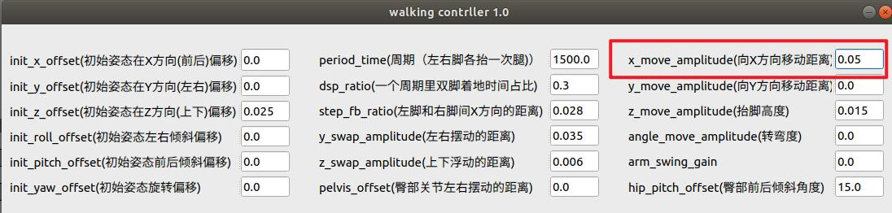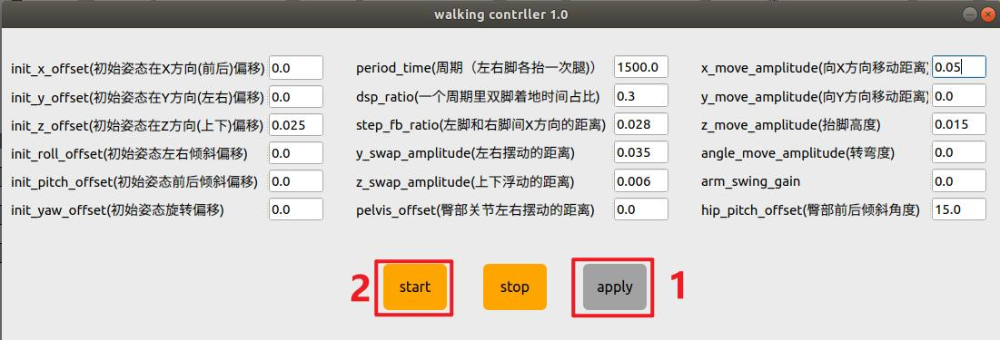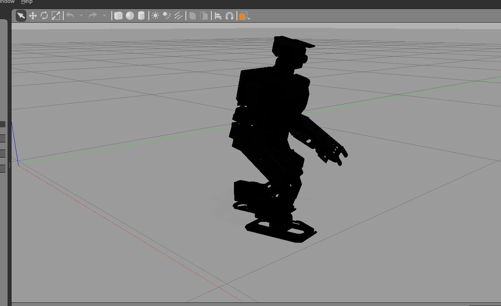

>  Click-on “apply”and “start” button in sequence.
>
>  If you need to make the robot cease movements, click-on
> “stop”button.
>
> 3\) After the parameters are set, you can check the robot’s
> performance on “**gazebo**” window.
>
> 3
